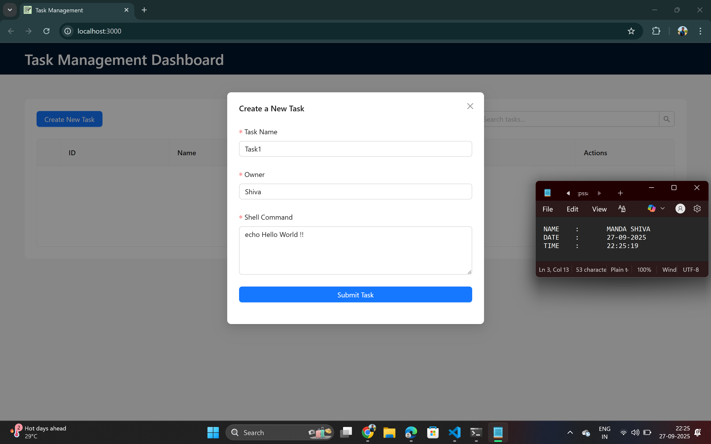
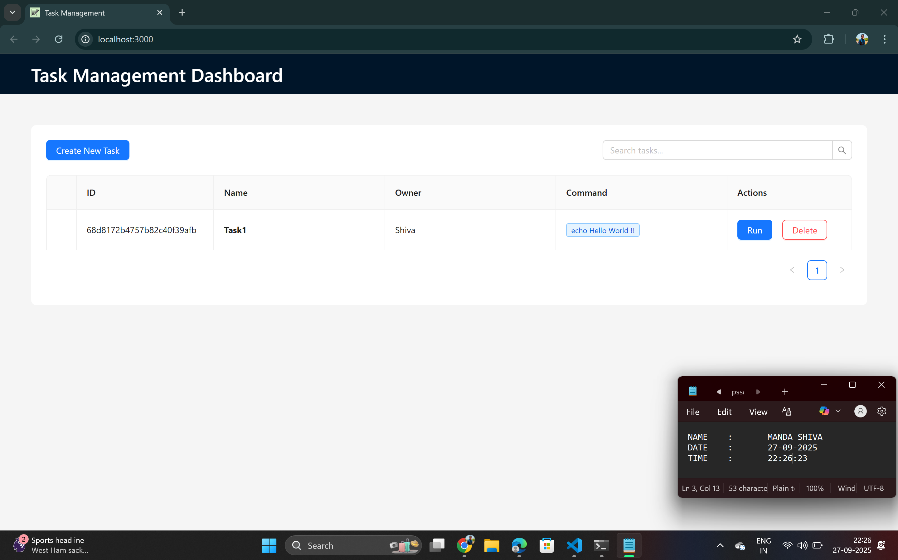
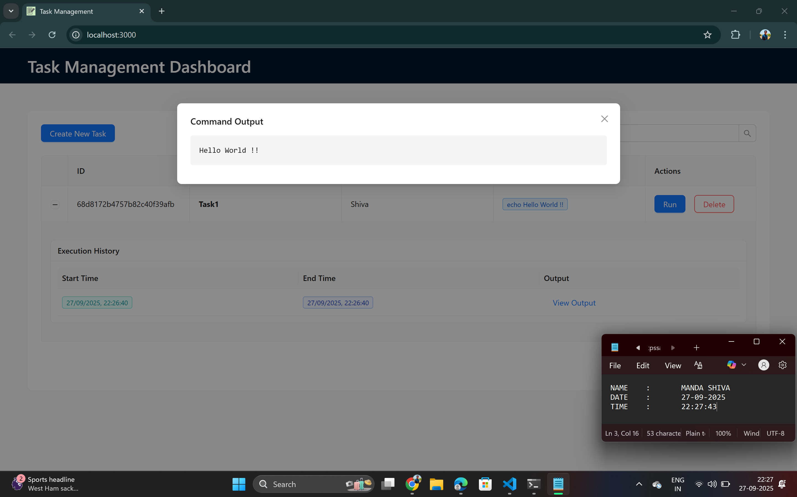
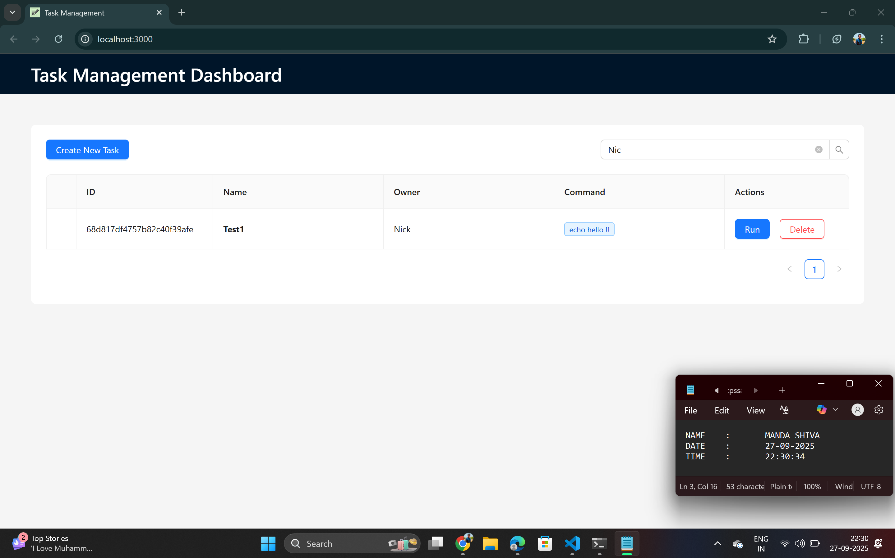

# Task Management Dashboard UI

A modern and responsive web interface for managing and executing server tasks. This dashboard allows users to create, view, run, and delete tasks, as well as review their execution history. This project was built with **React**, **TypeScript**, and **Ant Design**.

---

##  Video Demo
Watch Video here :[Demo Video](https://drive.google.com/file/d/1oKbYvPG0N61ORPWuB2MoOTJRmSiQh6nD/view?usp=sharing)

---

##  Features
- **View All Tasks:** See a comprehensive list of all available tasks in a clean, sortable table.  
- **Create Tasks:** An intuitive modal form to add new tasks with a name, owner, and shell command.  
- **Delete Tasks:** Securely delete tasks with a confirmation step.  
- **Execute Tasks:** Run any task directly from the dashboard with a single click.  
- **View Execution History:** Expand a task to see a detailed history of its past executions, including start/end times and command output.  
- **Real-time Search:** Instantly filter tasks by name, owner, or command.  
- **Responsive Design:** A fully responsive layout that works on desktop, tablet, and mobile devices.  

---

##  Tech Stack
- **Framework:** React (v18+)  
- **Language:** TypeScript  
- **UI Library:** Ant Design (v5)  

---

### Prerequisites
You need to have the following software installed on your machine:
- Node.js (v18.x or later recommended)  
- npm (v9.x or later) or yarn  

### Installation & Setup
**Note:** This project serves as the **frontend UI for Task 1**,

1. **Clone the repository**

git clone https://github.com/Shiva-Manda/Task3-Web-UI-Forms

2. **Navigate to the Project directory**

cd kaiburr-task-ui

3. **Install Dependencies**

npm install

4. **Set up environment variables**

REACT_APP_API_URL=http://localhost:8080

5. **Run the Application**

npm start

### Connecting to the Backend

*This frontend is designed to work with Task 1 backend. Make sure the backend server is running.*

*By default, this application tries to connect to the backend at http://localhost:8080. If your backend is running on a different address or port, make sure to update the REACT_APP_API_URL variable in your .env file.*

# Task 1
 git clone https://github.com/Shiva-Manda/Java-Backend-and-REST-API-Example

 ## Screenshots
**Create Task**

**Show**

**Run**

**Command Output**

**Delete**

**Search**

